# LudusGen vizsgaremek dokumentáció

Ez a dokumentáció a LudusGen projekt vizsgaremekhez készült részletes leírása.

Biztonsági okból a dokumentáció nem tartalmaz valós belépési adatokat, jelszavakat, API kulcsokat vagy személyes felhasználói előzményeket. A képernyőképeken az érzékeny részek szükség esetén maszkolva vannak.

A képernyőképek tényleges fájlokként a `docs/screenshots` mappában vannak. A README Markdown képbeágyazást használ, ezért GitHubon, VS Code Markdown Preview-ban vagy Markdownból készített PDF exportban a képek nem csak linkként, hanem látható képként jelennek meg.

Backend repository: [https://github.com/markoAlma/LudusGen_backend.git](https://github.com/markoAlma/LudusGen_backend.git)

## Vizsgakövetelmény ellenőrző lista

| Követelmény | Hol található a dokumentációban | Teljesítés |
| --- | --- | --- |
| a) Mi az alkalmazás célja? | [a) Az alkalmazás célja](#a-az-alkalmazás-célja-5-pont) | Részletes cél, célközönség, megoldott probléma, tipikus munkafolyamat. |
| b) Funkciók, menüpontok képernyőképekkel | [b) Funkciók és menüpontok](#b-funkciók-és-menüpontok-10-pont) | Route-ok, menüpontok, modulok, desktop képernyőképek, AI 3D összehasonlítás. |
| c) Mobilos/reszponzív különbségek képernyőképekkel | [c) Reszponzív megjelenés mobilon](#c-reszponzív-megjelenés-mobilon-10-pont) | Desktop-mobil összehasonlítás, Home, menü, Marketplace, AI Studio, Forum és Profile mobil képek. |
| d) Adattárolás, táblák, kapcsolatok | [d) Adattárolás](#d-adattárolás-5-pont) | Tárolási rétegek, Mermaid adatmodell, gyűjtemények kapcsolatai, adatfolyam. |
| e) Fontosabb backend végpontok | [e) Fontosabb backend végpontok](#e-fontosabb-backend-végpontok-10-pont) | Funkció, paraméter, konkrét válaszpéldák, hibakezelés, backend repo link. |
| f) Tesztelés képernyőképekkel | [f) Tesztelés](#f-tesztelés-3-pont) | Frontend, backend, integrációs tesztek, build és teszt képernyőképek, tesztelési indoklás. |

## Projekt áttekintés

A LudusGen három fő mappára épül:

| Mappa | Szerep | Fő technológiák |
| --- | --- | --- |
| `LudusGen_frontend` | A felhasználói felület. Itt található a React alkalmazás, az útvonalak, a komponensek, a Firebase kliensoldali kapcsolat, az AI Studio, a Marketplace és a Forum UI. | React 19, Vite, React Router, Firebase client SDK, axios, framer-motion, Three.js, MUI, lucide-react. |
| `LudusGen_backend` | Az API szerver. Kezeli a regisztrációt, bejelentkezést, 2FA-t, krediteket, AI provider hívásokat, marketplace műveleteket, fájlfeltöltést és 3D generálási feladatokat. | Node.js, Express, Firebase Admin, Firestore, Cloudinary, Backblaze B2/S3, Gemini/Groq/Mistral/OpenRouter/NVIDIA/ModelScope/Fal/DeAPI, Tripo3D, Trellis, valamint későbbi használatra megtartott Meshy integráció. |
| `LudusGen_testing` | A vizsgához dokumentált tesztprojekt. Frontend komponens tesztek, backend unit tesztek és integrációs auth flow tesztek vannak benne. | Vitest, jsdom, Testing Library, Firebase/axios/mock modulok. |

### Fő architektúra

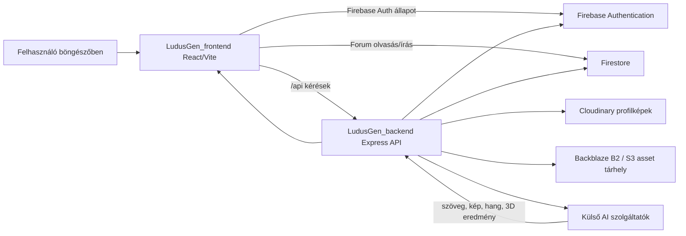
```mermaid
flowchart LR
    U["Felhasználó böngészőben"] --> F["LudusGen_frontend React/Vite"]
    F -->|"/api kérések"| B["LudusGen_backend Express API"]
    F -->|"Firebase Auth állapot"| FA["Firebase Authentication"]
    F -->|"Forum olvasás/írás"| FS["Firestore"]
    B --> FA
    B --> FS
    B --> CL["Cloudinary profilképek"]
    B --> B2["Backblaze B2 / S3 asset tárhely"]
    B --> AI["Külső AI szolgáltatók"]
    AI -->|"szöveg, kép, hang, 3D eredmény"| B
    B --> F
```

Ha a beadási rendszer nem rendereli a Mermaid diagramot, a [d) Adattárolás](#d-adattárolás-5-pont) fejezet táblázatai ugyanazt az adatmodellt szövegesen is tartalmazzák.

## a) Az alkalmazás célja (5 pont)

A LudusGen célja egy integrált, AI-alapú alkotói platform biztosítása játékfejlesztőknek, kreatív tartalomkészítőknek és digitális assetekkel dolgozó felhasználóknak. Az alkalmazás egy helyen egyesíti a szöveges AI asszisztenst, képgenerálást, hang- és zenegenerálást, 3D asset generálást, közösségi fórumot és kredit alapú marketplace-t.

A projekt nem csak egyetlen AI funkciót mutat be, hanem egy teljesebb alkotói munkafolyamatot:

1. A felhasználó regisztrál vagy bejelentkezik.
2. Az AI Studio-ban ötletet, kódot, képet, hangot vagy 3D modellt generál.
3. A generált tartalmat előzményként visszakeresi.
4. Saját assetet publikálhat a Marketplace-en.
5. Más felhasználók assetjeit kredittel megvásárolhatja.
6. A Community/Forum felületen kérdezhet, ötleteket oszthat meg, kommentelhet és követheti a közösségi aktivitást.

### Célközönség

| Célcsoport | Mire használhatja a LudusGent? |
| --- | --- |
| Játékfejlesztő tanulók | Prototípushoz képek, textúrák, hangok, 3D modellek és kódötletek gyors előállítására. |
| Indie fejlesztők | Kisebb játékprojektekhez asset workflow, inspiráció és marketplace használatára. |
| Tartalomkészítők | AI képek, hangok, TTS és kreatív ötletek generálására. |
| Közösségi felhasználók | Fórumozásra, kérdezésre, assetek megosztására és vásárlására. |

### Megoldott probléma

Sok AI eszköz külön felületen működik: külön kell képet generálni, külön kell hangot készíteni, külön kell 3D modellt létrehozni, külön kell fájlokat tárolni, és külön kell közösségi visszajelzést kérni. A LudusGen ezt egy egységes rendszerbe szervezi. A felhasználó ugyanazzal a profillal, ugyanazzal a kredit egyenleggel és ugyanazon webes felületen tud dolgozni.

### Fontosabb szakmai célok

- Biztonságos felhasználókezelés Firebase Authentication és backend oldali token ellenőrzés segítségével.
- Kredit alapú használat AI generálásokhoz és marketplace vásárlásokhoz.
- Több AI provider egységes kezelése backend végpontokon keresztül.
- Felhasználóhoz kötött előzmények és assetek tárolása Firestore-ban.
- Fájlok külön objektumtárban tárolása, metaadatok Firestore-ban tartása.
- Reszponzív frontend, amely desktopon és mobilon is használható.
- Tesztelt auth, profil és frontend context/login működés.

## b) Funkciók és menüpontok (10 pont)

### Fő útvonalak és menüpontok

| Menüpont / oldal | Útvonal | Védett? | Funkció |
| --- | --- | --- | --- |
| Home | `/` | Nem | Angol nyelvű, újratervezett kezdőlap, termékbemutató, fő navigáció és belépési pont. |
| AI Studio | `/chat` | Igen | AI Code/Chat, Image, Audio és 3D modulok közös munkaterülete. |
| AI Code | `/chat?tab=chat` | Igen | Szöveges asszisztens, kódolási segítség, modellválasztás, chat sessionök. |
| AI Image | `/chat?tab=image` | Igen | Képgenerálás, képfeldolgozás, galéria, upscale és vizuális workflow. |
| AI Audio | `/chat?tab=audio` | Igen | TTS, zene- és hanggenerálás, audio előzmények és letöltés. |
| AI 3D | `/chat?tab=3d` | Igen | Trellis (NVIDIA) és Tripo3D alapú 3D generálás, task státusz és modell letöltés. |
| Marketplace | `/marketplace` | Részben | Assetek böngészése publikus, vásárlás/feltöltés bejelentkezéshez kötött. |
| Community / Forum | `/forum/*` | Részben | Közösségi bejegyzések, kommentek, tagek, követések és értesítések. |
| Access Hub | Modal a navbarból | Nem | Bejelentkezés, regisztráció, Google login, jelszó-visszaállítás, 2FA flow. |
| Profile / Settings | `/profile`, `/settings` | Igen | Profiladatok, profilkép, 2FA, jelszó, kreditek és tranzakciók. |
| Legal | `/legal/:slug` | Nem | Jogi és információs oldalak slug alapján. |
| Reset Password | `/reset-password` | Nem | Jelszó-visszaállítási folyamat. |
| Verify Email | `/verify-email` | Nem | Email megerősítés visszajelzése. |

### Home

A kezdőlap a LudusGen belépési felülete. A legutóbbi redesign után a teljes home oldal angol nyelvű, sötét, filmes AI Studio hangulatú felületet kapott. Desktopon széles hero blokk, lebegő 3D vizuális elem, új statisztikai sáv, funkciókártyák, valós LudusGen modul preview képek, kreditcsomagok és záró call-to-action jelenik meg.

Funkciói:

- navigáció a fő modulok felé;
- bejelentkezési/regisztrációs modal megnyitása;
- platform értékajánlatának bemutatása angol szövegekkel;
- AI Studio, Marketplace és Community irányába vezető belépési pont;
- aktuális modellstatisztikák megjelenítése a frontend modellkonfiguráció alapján;
- friss, saját LudusGen preview képek bemutatása a Chat, Image, Audio és 3D modulokról.

Aktuális home statisztikák:

| Home stat | Jelenlegi érték | Forrás |
| --- | ---: | --- |
| Chat model | 10 | `ALL_MODELS`, `panelType === "chat"` |
| Image tool | 9 | `ALL_MODELS`, `panelType === "image"` |
| Audio model | 6 | `ALL_MODELS`, `panelType === "audio"` |
| 3D workflow | 2 | Trellis és Tripo3D aktív 3D modellek |

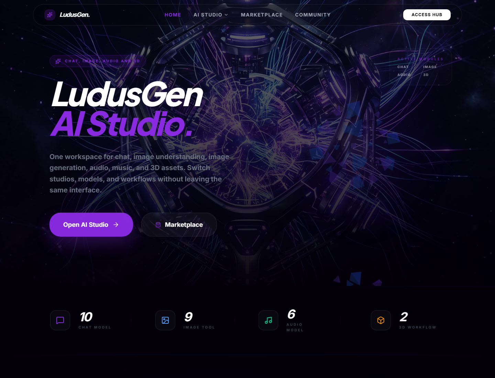

*1. kép: Home oldal desktop nézetben.*

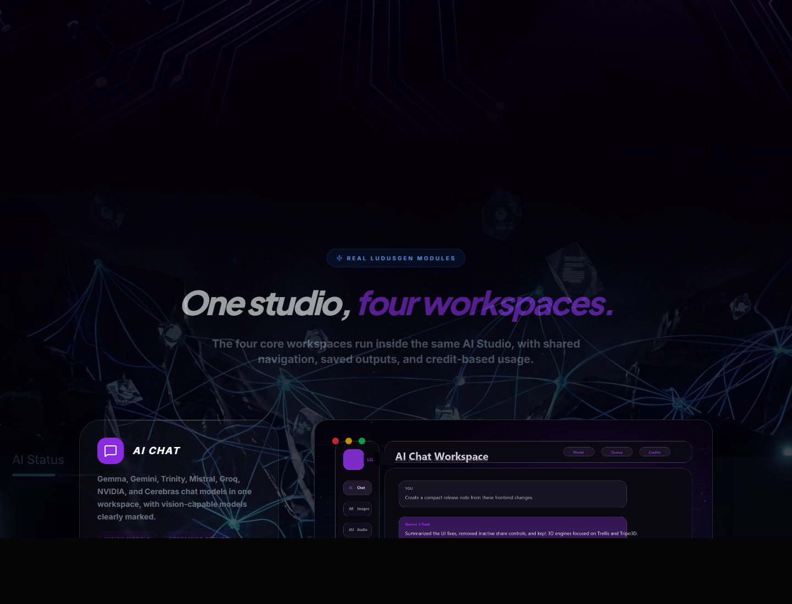

*2. kép: Home modul preview blokk valós LudusGen munkaterület-képekkel.*

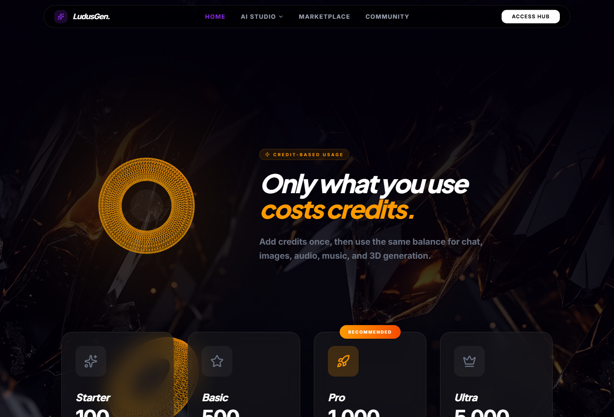

*3. kép: Home kreditcsomag és pricing szekció.*

### Access Hub: bejelentkezés, regisztráció és 2FA

Az Access Hub a hitelesítési felület. A navbarból nyílik, és több auth folyamatot kezel egy modalon belül.

Fő funkciók:

- email/jelszó alapú bejelentkezés;
- új felhasználó regisztrációja;
- Google bejelentkezési gomb;
- jelszó-visszaállítás indítása;
- 2FA ellenőrzés olyan felhasználóknál, akiknél be van kapcsolva;
- hibajelzések rossz email, hiányzó mező, rossz jelszó vagy sikertelen 2FA esetén.

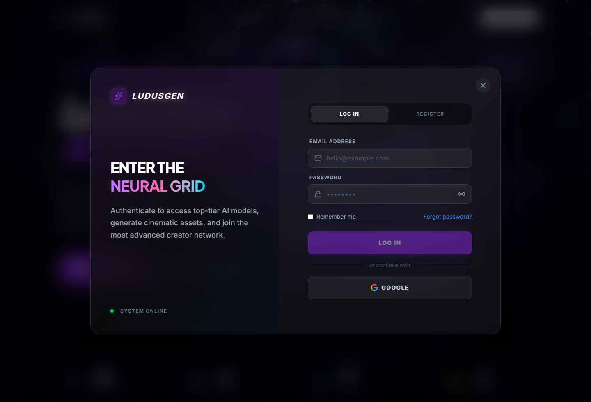

*4. kép: Access Hub / login modal desktop nézetben.*

### AI Studio

Az AI Studio a LudusGen központi alkotói felülete. Bejelentkezés után érhető el, mert a generálások, előzmények, kredit használat és assetek felhasználóhoz kötődnek.

Az AI Studio felépítése:

- modulválasztó navigáció a Chat, Image, Audio és 3D munkaterületek között;
- modellválasztó sáv a kiválasztott AI típushoz, a modellek felhasználóbarát nevével;
- középső munkaterület, amely a kiválasztott panelt jeleníti meg;
- session és history kezelés;
- háttérben backend API hívások, tokenes azonosítással.

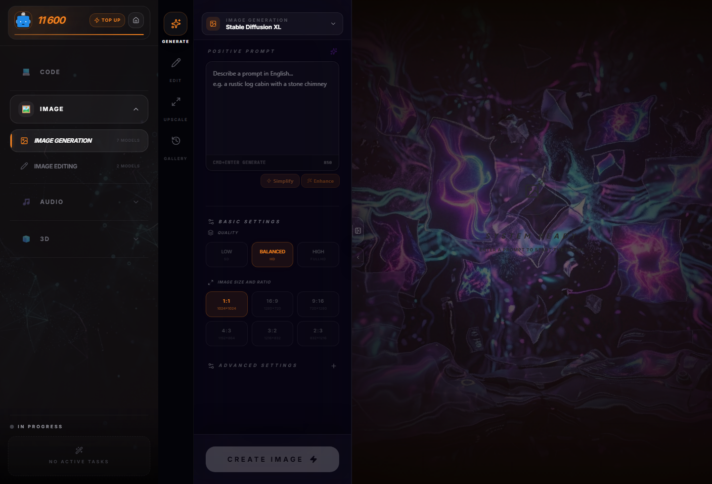

*5. kép: AI Studio desktop nézetben, az Image Studio generáló munkaterületével. A személyes felhasználói részletek maszkolva vannak.*

#### AI Code / Chat modul

Az AI Code a szöveges asszisztens és programozási segítő modul. A felhasználó promptot ír, modellt választ, a backend pedig továbbítja a kérést a megfelelő AI szolgáltatóhoz.

Funkciók:

- chat session létrehozása és folytatása;
- korábbi sessionök betöltése;
- modellváltás több aktuális chat provider között;
- prompt javítás/enhance;
- képes bemenet vagy vision jellegű leírás támogatása;
- futó AI válasz megszakítása;
- hosszabb beszélgetések összefoglalása.

Jelenlegi chat modellek száma: 10.

Részletes működés (kódgenerálás és AI summary):

1. A felhasználó kiválasztja a chat modellt és elküldi a promptot.
2. A frontend a promptot, a session azonosítót és a modelladatokat tokenes kérésben továbbítja a backend felé.
3. A backend a kiválasztott providerhez irányítja a hívást, majd a választ streamelve vagy teljes blokként visszaadja.
4. A beszélgetés a felhasználói előzmények közé mentődik, így később visszatölthető.
5. Hosszabb session esetén összefoglaló (`summary`) készül, hogy a kontextus gyorsabban visszaállítható legyen.

| Kódgenerálási elem | Mit csinál? |
| --- | --- |
| Prompt + kontextus | Programozási vagy általános AI feladat megfogalmazása. |
| Modellválasztás | Feladathoz igazított provider/model páros kiválasztása. |
| Válaszfolyam | Streamelt vagy teljes válasz megjelenítése a chatben. |
| Session memória | Beszélgetések visszakeresése és folytathatósága. |
| Összefoglaló (summary) | Hosszú sessionök tömör kivonata gyors visszakapcsolódáshoz. |

#### AI Image modul

Az AI Image képgenerálási és képfeldolgozási felület.

Funkciók:

- prompt alapú képgenerálás;
- negatív prompt, képméret, arány, seed és darabszám beállítása;
- generált képek mentése előzménybe;
- image gallery lekérése;
- kép letöltése;
- kép upscale;
- textúra- vagy képszerkesztési workflow.
- inaktív share ikonok eltávolítása a generált képek és archív kártyák felületéről.

Jelenlegi image tool szám: 9.

Részletes működés (képgenerálás):

1. A felhasználó promptot, képarányt, méretet, seedet és darabszámot ad meg.
2. A backend a beállítások alapján a megfelelő image provider endpointot hívja.
3. Az elkészült képek URL-jei és metaadatai history-be kerülnek.
4. A felhasználó képet tölthet le, upscale-elhet vagy új prompttal iterálhat.
5. A generálás eredménye asset workflow-ba is továbbvihető (pl. Marketplace feltöltés vagy külső felhasználás).

| Képgenerálási elem | Mit csinál? |
| --- | --- |
| Prompt + negatív prompt | Vizuális cél és tiltott jegyek finomhangolása. |
| Paraméterezés | Arány, méret, seed és darabszám kontrollálása. |
| History és galéria | Korábbi képek visszakeresése és újrafelhasználása. |
| Upscale | Kimeneti kép részletességének növelése. |
| Letöltés | Lokális vagy további pipeline célú felhasználás. |

#### AI Audio modul

Az AI Audio a beszéd, zene és hang generálását kezeli.

Funkciók:

- text-to-speech generálás;
- zene generálás prompt alapján;
- Qwen3 TTS, Kokoro, Chatterbox és Magpie TTS sorrendű beszédmodell-választás;
- ACE-Step zenei modellek használata;
- referencia audio használata bizonyos folyamatoknál;
- generált audio history;
- audio fájl letöltése.
- inaktív share ikonok eltávolítása a generált audio/music kártyákról, a Community kivételével.

Jelenlegi audio modellek száma: 6.

Részletes működés (audio generálás):

1. A felhasználó kiválasztja, hogy beszédet (TTS) vagy zenét szeretne generálni.
2. A backend a kiválasztott audio modellhez továbbítja a promptot vagy szöveget.
3. A válasz audio fájlként érkezik vissza, amely history-be mentődik.
4. A felhasználó visszahallgathatja, letöltheti, majd újrapróbálhatja módosított paraméterekkel.
5. A referencia audio támogatott flow-kban stílus- vagy karaktervezérelt eredményt ad.

| Audio elem | Mit csinál? |
| --- | --- |
| TTS mód | Szöveg természetes beszéddé alakítása. |
| Zene mód | Prompt alapú zenei/hangulati generálás. |
| Modellválasztó | Feladattípushoz illő TTS vagy zenei modell kiválasztása. |
| Audio history | Visszakereshető korábbi eredmények. |
| Letöltés | Generált hangfájl exportálása. |

#### AI 3D modul

Az AI 3D a LudusGen egyik legerősebb része. A jelenlegi publikus modellválasztóban két aktív 3D útvonal látható: Trellis (NVIDIA) és Tripo3D. A korábbi TripoSR és Trellis.2 modellek ki lettek véve a 3D modelllistából. A Meshy kódja megmaradt a projektben későbbi felhasználásra, de jelenleg kommentelve/rejtve van, ezért a felületen nem jelenik meg.

Funkciók:

- Tripo3D text/image/task alapú modellgenerálás;
- Tripo task státusz lekérése és SSE stream;
- Tripo modell proxyzott letöltése;
- Trellis (NVIDIA) 3D generálás és history kezelés;
- 3D modell fájlok objektumtáras kezelése;
- taskok megszakítása, státuszfigyelése és előzményből visszatöltése.

Aktív AI 3D provider összehasonlítás:

| Provider | Mire jó leginkább? | Bemenet | Kimenet | LudusGen szerep |
| --- | --- | --- | --- | --- |
| Tripo3D | Összetettebb 3D pipeline-ok, text/image/model alapú taskok, import és letöltés. | Prompt, kép, modellfájl vagy pipeline paraméter. | Task, modell URL, proxyzott letöltés, history. | Teljes 3D workflow: task indítás, státusz, becslés, proxy és library. |
| Trellis (NVIDIA) | NVIDIA alapú 3D generálás és modellfájl kezelés. | Prompt vagy generálási paraméterek. | 3D modellfájl és history. | Alternatív 3D generálási útvonal és modell kiszolgálás. |

Nem látható, de kódban megtartott integráció:

| Integráció | Jelenlegi állapot | Megjegyzés |
| --- | --- | --- |
| Meshy | Rejtve / kommentelve | Későbbi újraaktiváláshoz a kódbázisban maradt, de a felületen nem választható. |

Részletes működés (3D generálás):

1. A felhasználó Tripo3D vagy Trellis útvonalat választ.
2. Prompt, referencia kép vagy task paraméterek alapján indul a 3D feladat.
3. A backend task-azonosítót ad vissza, majd státuszpolling/SSE alapján követi a futást.
4. Kész állapotban a modellfájl proxyzott letöltési útvonalon vagy tárolt assetként érhető el.
5. A history-ben tárolt taskok újranyithatók, így gyorsabban iterálható a 3D workflow.

| 3D pipeline elem | Mit csinál? |
| --- | --- |
| Task indítás | 3D generálási folyamat elindítása prompt/kép alapján. |
| Státuszfigyelés | Folyamat állapotának követése és hibák visszajelzése. |
| Proxy letöltés | Kész modell biztonságos letöltése backend közvetítéssel. |
| History | Régi taskok és modellek visszakeresése. |
| Provider dualitás | Tripo3D és Trellis közötti rugalmas váltás. |

### AI modul képpackek

Az alábbi képpack a fő generáló modulok vizuális előnézetét mutatja, így a dokumentációban a funkciók mellett a felületi különbségek is gyorsan átláthatók.

#### Chat / Code pack

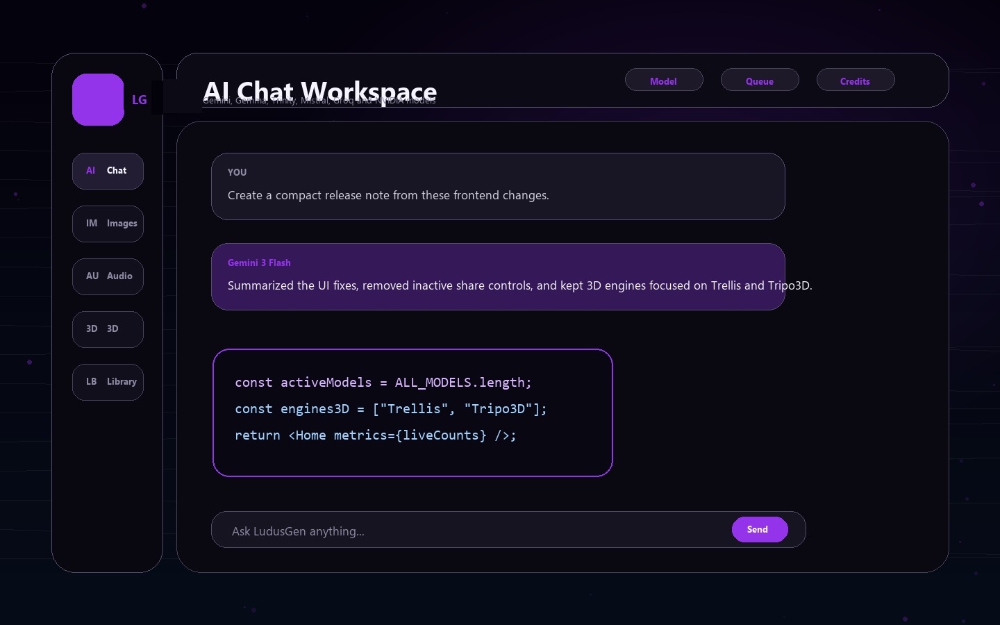

*6. kép: AI Chat/Code modul előnézeti képe.*

#### Image pack

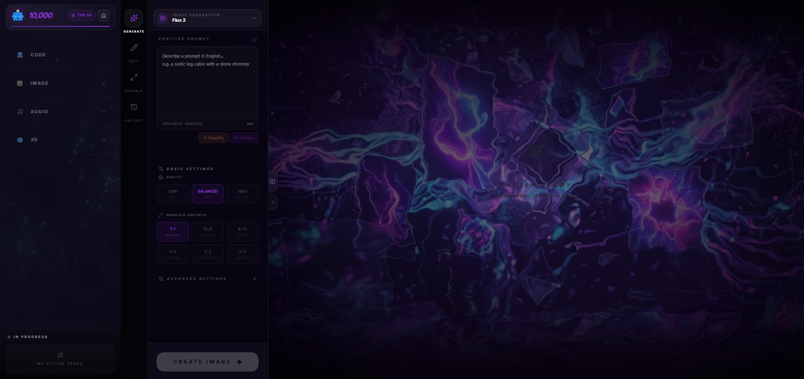

*7. kép: AI Image modul előnézeti képe.*

#### Audio pack

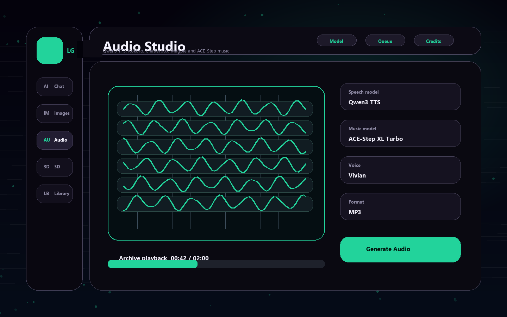

*8. kép: AI Audio modul előnézeti képe.*

#### 3D pack

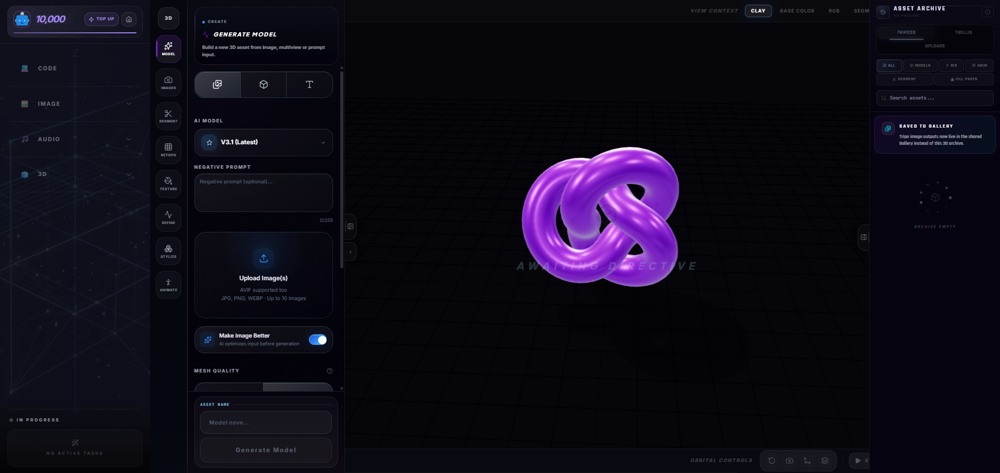

*9. kép: AI 3D modul előnézeti képe.*

### Marketplace

A Marketplace közösségi asset piactér. A felhasználók asseteket böngészhetnek, szűrhetnek, megvásárolhatnak és publikálhatnak. A vásárlási logika kredit alapú, a fájlok tárolása objektumtárban történik, a metaadatok Firestore-ban vannak.

Fő funkciók:

- asset lista megjelenítése;
- keresés cím, leírás vagy tag alapján;
- típus szerinti szűrés: image, audio, 3D;
- ár szerinti minimum/maximum szűrés;
- rendezés: kiemelt, legújabb, ár szerint, legtöbbet vásárolt;
- tulajdon szerinti szűrés: saját, megvásárolt, nem megvásárolt;
- Tripo kompatibilitási szűrés 3D assetekhez;
- asset részletező modal;
- új asset feltöltése fájlból vagy generálási előzményből;
- jognyilatkozat elfogadása publikálás előtt;
- kredit alapú vásárlás;
- saját könyvtár megvásárolt assetekhez;
- letöltés jogosultság ellenőrzés után;
- saját asset módosítása vagy törlése.

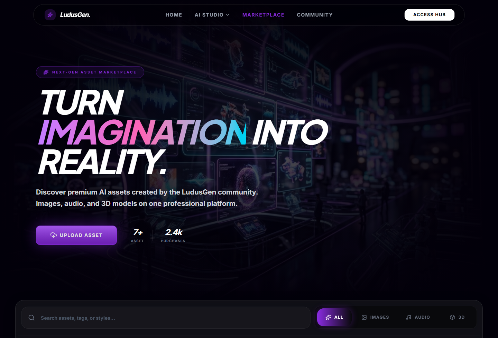

*10. kép: Marketplace desktop nézetben, hero résszel, kereséssel és szűrőkkel.*

### Community / Forum

A Community/Forum rész a közösségi kommunikációt támogatja. A frontend közvetlenül Firestore gyűjteményeket használ a fórumhoz, így a bejegyzések, kommentek, bookmarkok és értesítések gyorsan frissülnek.

Fő funkciók:

- fórum bejegyzések listázása;
- új topic létrehozása;
- bejegyzés cím, tartalom, csatorna és tagek megadása;
- kommentelés és válaszok;
- like, megtekintés és bookmark;
- követések;
- értesítések;
- keresés és rendezés;
- csatornák például Code AI, Image AI, Audio AI és 3D AI témákhoz.

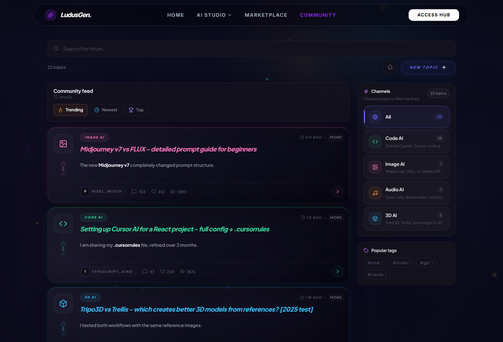

*11. kép: Community / Forum desktop nézetben.*

### Profile / Settings

A profil oldal a bejelentkezett felhasználó személyes beállításait kezeli.

Fő funkciók:

- display name, név és bio módosítása;
- profilkép feltöltése Cloudinary tárolásra;
- profilkép törlése;
- email megjelenítése;
- jelszó módosítás;
- 2FA bekapcsolás QR kóddal;
- 2FA kikapcsolás;
- aktuális kredit egyenleg megjelenítése;
- kredit csomag igénylés vagy feltöltés;
- kredit tranzakciós előzmények megtekintése.

## c) Reszponzív megjelenés mobilon (10 pont)

A LudusGen mobilon nem csak kisebb méretben jelenik meg, hanem a felület szerkezete is átrendeződik. Desktopon a navigáció vízszintes, a hero tartalom nagyobb vizuális felületen szerepel, a Marketplace és Forum többoszlopos elrendezést használ. Mobilon ezek egyoszlopos, érintésbarát layoutba kerülnek.

### Desktop és mobil különbségek

| Felületrész | Desktop működés | Mobil működés |
| --- | --- | --- |
| Navigáció | Vízszintes navbar: Home, AI Studio, Marketplace, Community, Access Hub/user menü. | Hamburger ikon nyitja a teljes képernyős vagy lenyíló mobil menüt. |
| AI Studio menü | Desktopon az AI Studio almenü lenyílóként jelenik meg: AI Code, AI Image, AI Audio, AI 3D. | Mobilon a studio modulok nagy, különálló, érintésbarát blokkban jelennek meg. |
| Home hero | Nagy vizuális kompozíció, széles szövegblokkok és CTA gombok. | A cím több sorba törik, a gombok és szövegek kisebb képernyőn olvasható sorrendbe kerülnek. |
| Gombok | Desktopon kompaktabb, egymás melletti CTA-k. | Nagyobb érintési felület, kényelmesebb mobil kattintási célpontok. |
| Marketplace | Többoszlopos kártyarács és szűrősáv. | Egyoszlopos kártyák, görgethető lista, a szűrők és statisztikák egymás alá kerülnek. |
| Forum | Feed, oldalsó blokkok és kategóriaelemek szélesebb elrendezésben. | A tartalom elsődlegessé válik, a kiegészítő blokkok lejjebb rendeződnek vagy eltűnnek. |
| Profile | Desktopon szélesebb beállítási panelek jelenhetnek meg. | A profilkártya, biztonsági központ, fiókadatok és kreditek egymás alá rendeződnek. |
| Modalok | Középre igazított, desktop méretű panelek. | Keskenyebb, mobil szélességhez igazított modalok, görgethető tartalommal. |
| Kártyák | Több kártya fér egy sorba. | A kártyák teljes szélességet használnak, hogy a szöveg és gombok ne zsúfolódjanak. |

### Mobil Home

Mobilon a kezdőlap elsődleges célja az olvashatóság és az azonnali navigálhatóság. A hero tartalom nem veszíti el a lényegét, de a szöveg és a gombok kisebb képernyőn egymás alá kerülnek.

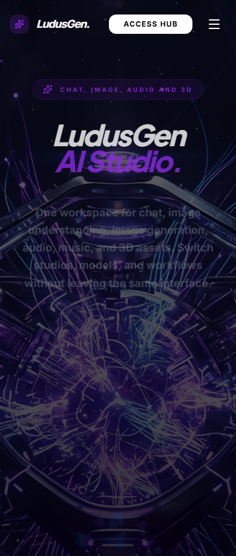

*12. kép: Home oldal mobil nézetben.*

### Mobil navigáció

Mobilon a desktop navbar helyett hamburger menü jelenik meg. Ebben a fő menüpontok egymás alatt, jól érinthető sorokban szerepelnek.

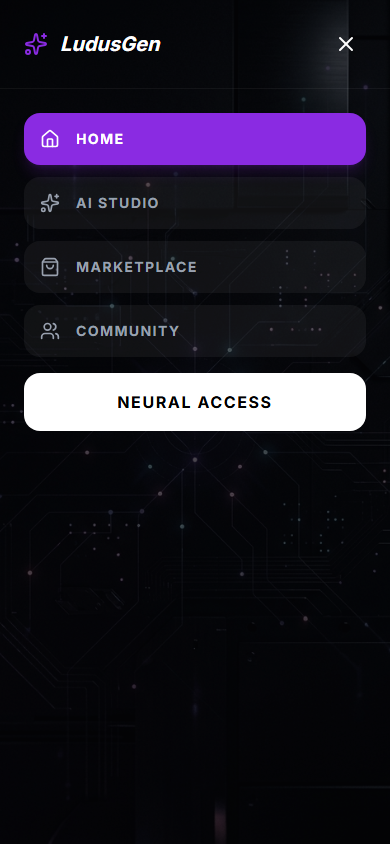

*13. kép: Mobil hamburger menü.*

### Mobil Marketplace

A Marketplace mobilon egyoszlopos nézetet használ. Ez azért fontos, mert az asset kártyák képei, címei, árai és gombjai így nem törnek össze, hanem természetes görgetési sorrendben jelennek meg. A szűrők mobilon külön blokkba rendeződnek, így telefonon is marad hely a keresésnek, a típusválasztónak és az ármezőknek.

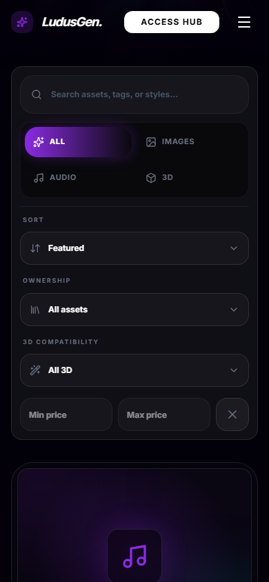

*14. kép: Marketplace mobil nézetben, keresővel, szűrőpanellel és az asset lista kezdetével.*

### Mobil AI Studio

Mobilon az AI Studio a rendelkezésre álló szélességhez igazítja a modulválasztót. A desktop oldalsáv kompakt, érintésbarát modulblokkokká alakul, amelyek ujjal könnyen megnyithatók. A kredit és felhasználói állapot a felső részben marad, a futó taskok és az aktív generálási folyamatok pedig a képernyő alatt folytatódó görgethető nézetben jelennek meg.

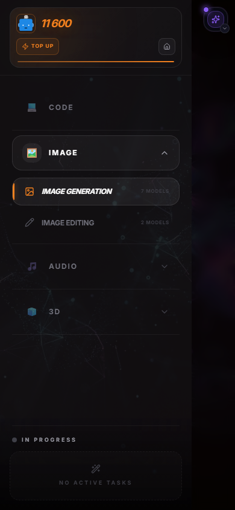

*15. kép: AI Studio mobil nézetben, megnyitott Image modullal.*

### Mobil Forum

A Forum mobilon feed-szerű nézetre vált. A kategóriák, szűrők és témakártyák egymás alatt jelennek meg, így egy telefonon is könnyen görgethető marad a közösségi tartalom.

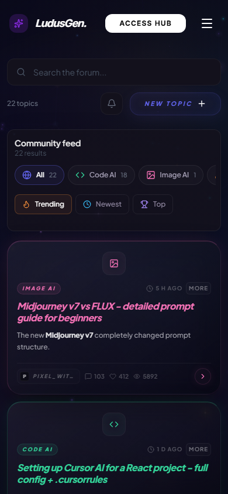

*16. kép: Community / Forum mobil nézetben.*

### Mobil Profile

A Profile/Settings oldal mobilon teljesen egymás alá rendezi a személyes adatokat, biztonsági beállításokat, fiókadatokat és kredit blokkot. A képernyőképen az email cím maszkolt tesztértékként szerepel.

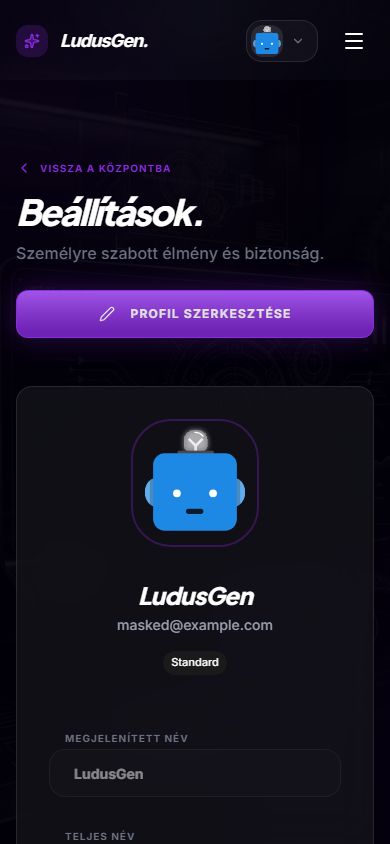

*17. kép: Profile / Settings mobil nézetben, maszkolt tesztadatokkal.*

### Reszponzív tervezési szempontok

- A fő navigáció állapotalapú mobil menüre vált.
- A nagy desktop blokkok mobilon egymás alá rendeződnek.
- Az interaktív elemek érintésbarát méretet kapnak.
- A Marketplace kártyák és szűrők mobilon nem zsúfolódnak egymás mellé.
- Az AI Studio modulválasztója mobilon nagyobb érintési felületeket használ.
- A Profile beállítási kártyái mobilon egyoszlopos szerkezetben jelennek meg.
- A képek és panelek rendelkezésre álló szélességhez igazodnak.
- A szövegek tördelése mobilon olvasható marad.
- A védett oldalaknál a bejelentkezési állapot továbbra is ugyanúgy érvényesül, csak a navigációs megjelenés változik.

## d) Adattárolás (5 pont)

A LudusGen több adattárolási réteget használ. A rövid szabály: az azonosítás Firebase Auth-ban van, a strukturált alkalmazásadat Firestore-ban, a nagy bináris fájlok pedig külső fájltárolókban.

### Tárolási rétegek

| Réteg | Mire szolgál? | Példa adat |
| --- | --- | --- |
| Firebase Authentication | Felhasználói azonosítás, email/jelszó és Google login. | UID, email, email verification, auth token. |
| Firestore | Strukturált appadatok és kapcsolatok. | Profil, kredit, chat session, fórum poszt, marketplace asset metaadat. |
| Cloudinary | Profilképek tárolása. | Profilkép URL és public id. |
| Backblaze B2 / S3 kompatibilis tárhely | Nagy asset fájlok, preview fájlok, 3D modellek. | `.glb`, `.fbx`, image/audio fájl, preview kép. |
| Külső AI szolgáltatók | Generálási feladatok végrehajtása. | Gemini/Groq/Mistral/OpenRouter/NVIDIA/ModelScope/Fal/DeAPI válaszok, Tripo3D/Trellis taskok, valamint backendben megtartott Meshy task kód. |

### Adatmodell és kapcsolatok

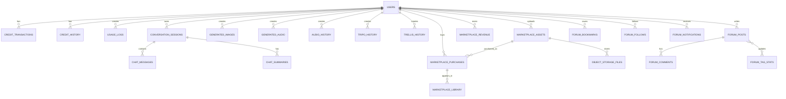
```mermaid
erDiagram
    USERS ||--o{ CREDIT_TRANSACTIONS : has
    USERS ||--o{ CREDIT_HISTORY : has
    USERS ||--o{ USAGE_LOGS : creates

    USERS ||--o{ CONVERSATION_SESSIONS : owns
    CONVERSATION_SESSIONS ||--o{ CHAT_MESSAGES : contains
    CONVERSATION_SESSIONS ||--o{ CHAT_SUMMARIES : has

    USERS ||--o{ GENERATED_IMAGES : creates
    USERS ||--o{ GENERATED_AUDIO : creates
    USERS ||--o{ AUDIO_HISTORY : creates
    USERS ||--o{ TRIPO_HISTORY : creates
    USERS ||--o{ TRELLIS_HISTORY : creates

    USERS ||--o{ MARKETPLACE_ASSETS : uploads
    USERS ||--o{ MARKETPLACE_PURCHASES : buys
    MARKETPLACE_ASSETS ||--o{ MARKETPLACE_PURCHASES : purchased_as
    MARKETPLACE_PURCHASES ||--o{ MARKETPLACE_LIBRARY : appears_in
    MARKETPLACE_ASSETS ||--o{ OBJECT_STORAGE_FILES : stores
    USERS ||--o{ MARKETPLACE_REVENUE : earns

    USERS ||--o{ FORUM_POSTS : writes
    FORUM_POSTS ||--o{ FORUM_COMMENTS : has
    USERS ||--o{ FORUM_BOOKMARKS : saves
    USERS ||--o{ FORUM_FOLLOWS : follows
    USERS ||--o{ FORUM_NOTIFICATIONS : receives
    FORUM_POSTS }o--o{ FORUM_TAG_STATS : updates
```

### Generálási adatfolyam

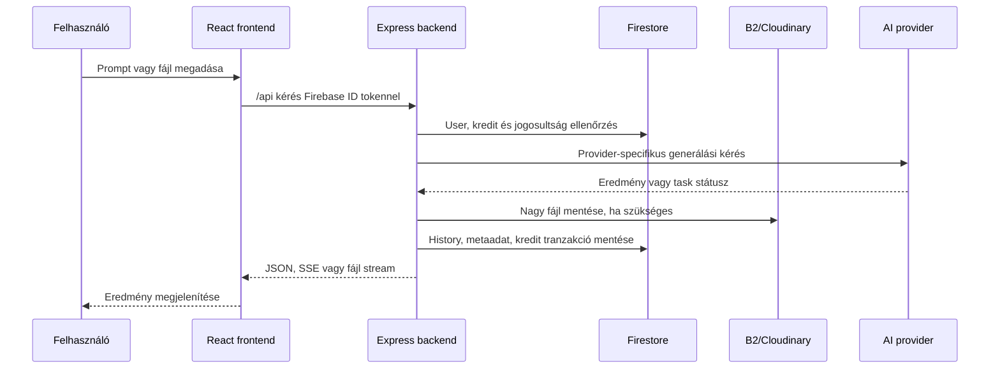
```mermaid
sequenceDiagram
    participant User as Felhasználó
    participant Frontend as React frontend
    participant Backend as Express backend
    participant Firestore as Firestore
    participant Storage as B2/Cloudinary
    participant AI as AI provider

    User->>Frontend: Prompt vagy fájl megadása
    Frontend->>Backend: /api kérés Firebase ID tokennel
    Backend->>Firestore: User, kredit és jogosultság ellenőrzés
    Backend->>AI: Provider-specifikus generálási kérés
    AI-->>Backend: Eredmény vagy task státusz
    Backend->>Storage: Nagy fájl mentése, ha szükséges
    Backend->>Firestore: History, metaadat, kredit tranzakció mentése
    Backend-->>Frontend: JSON, SSE vagy fájl stream
    Frontend-->>User: Eredmény megjelenítése
```

### Fontosabb Firestore gyűjtemények

| Gyűjtemény / útvonal | Mit tárol? | Fő mezők / kapcsolatok |
| --- | --- | --- |
| `users` | Felhasználói profil és app szintű állapot. | `uid`, `email`, `displayName`, `name`, `bio`, `credits`, `profilePicture`, `twoFactorEnabled`, `createdAt`, `updatedAt`. |
| `users/{uid}/creditTransactions` | Felhasználóhoz tartozó kredit tranzakciók. | `amount`, `type`, `description`, `createdAt`, kapcsolat: `users.uid`. |
| `credit_history/{uid}/transactions` | Kredit előzmény külön naplózása. | AI és marketplace költségek, jóváírások, csomagok. |
| `conversations/{userId}/sessions` | Chat session metaadatok. | `sessionId`, `title`, `modelId`, `createdAt`, `updatedAt`, kapcsolat: `users.uid`. |
| `conversations/{userId}/sessions/{sessionId}/messages` | Chat üzenetek. | `role`, `content`, `model`, `createdAt`, `attachments`. |
| `conversations/{userId}/sessions/{sessionId}/chat_summaries` | Hosszabb beszélgetések összefoglalói. | `summary`, `messageCount`, `createdAt`. |
| `usage_logs` | AI használati napló. | `uid`, `provider`, `model`, `operation`, `credits`, `createdAt`. |
| `generated_images` | Képgenerálások metaadatai. | `uid`, `prompt`, `provider`, `imageUrl`, `settings`, `createdAt`. |
| `generated_audio` | Generált audio metaadatok. | `uid`, `prompt/text`, `provider`, `audioUrl`, `createdAt`. |
| `audio_history` | Audio előzmények és letölthető fájlok. | `uid`, `fileKey`, `mimeType`, `duration`, `createdAt`. |
| `audio_generations` | Audio generálási feladatok technikai naplója. | `jobId`, `status`, `provider`, `result`. |
| `tripo_history` | Tripo 3D task előzmények. | `uid`, `taskId`, `type`, `status`, `modelUrl`, `b2Key`, `expiresAt`. |
| `trellis_history` | Trellis 3D generálások. | `uid`, `prompt`, `status`, `modelFile`, `createdAt`. |
| `marketplace_assets` | Publikus vagy listázott marketplace assetek. | `ownerId`, `title`, `description`, `assetType`, `priceCredits`, `tags`, `storageKey`, `previewUrl`, `createdAt`. |
| `marketplace_purchases` | Marketplace vásárlások. | `buyerId`, `sellerId`, `assetId`, `priceCredits`, `createdAt`. |
| `marketplace_library` | Felhasználói asset könyvtár. | `uid`, `assetId`, `purchaseId`, `downloadAccess`. |
| `marketplace_revenue` | Eladói bevétel és elszámolás. | `sellerId`, `assetId`, `purchaseId`, `amountCredits`. |
| `forum_posts` | Fórum bejegyzések. | `authorId`, `title`, `content`, `channel`, `tags`, `likes`, `views`, `createdAt`. |
| `forum_comments` | Fórum kommentek. | `postId`, `authorId`, `content`, `createdAt`. |
| `forum_notifications` | Fórum értesítések. | `recipientId`, `type`, `postId`, `read`, `createdAt`. |
| `forum_bookmarks` | Mentett posztok. | `uid`, `postId`, `createdAt`. |
| `forum_follows` | Követési kapcsolatok. | `followerId`, `targetId`, `type`. |
| `forum_tag_stats` | Tag statisztikák. | `tag`, `usageCount`, `lastUsedAt`. |

### Miért így van szétválasztva az adat?

- A Firestore alkalmas gyors, strukturált lekérdezésekre, például profil, fórum és marketplace metaadatokhoz.
- A nagy fájlok Firestore-ban nem lennének hatékonyak, ezért kerülnek B2/S3 vagy Cloudinary tárolóba.
- A backend ellenőrzi a jogosultságot, mielőtt letöltési URL-t, proxyzott fájlt vagy marketplace vásárlást enged.
- A kredit tranzakciókat külön gyűjteményekben is naplózza a rendszer, hogy később visszakereshető legyen, mire fogyott vagy hogyan nőtt az egyenleg.

## e) Fontosabb backend végpontok (10 pont)

Backend repository: [https://github.com/markoAlma/LudusGen_backend.git](https://github.com/markoAlma/LudusGen_backend.git)

Lokális backend mappa: `C:\LudusGen\LudusGen_backend`

A frontend fejlesztés közben a Vite proxy a `/api` kéréseket a backend szerverre továbbítja. A védett végpontok Firebase ID tokent várnak:

```http
Authorization: Bearer <firebase-id-token>
```

### Auth, profil, 2FA és kreditek

| Végpont | Funkció | Paraméterek | Visszatérési érték | Hibakezelés |
| --- | --- | --- | --- | --- |
| `POST /api/register-user` | Új user létrehozása Firebase Auth-ban, email megerősítés küldése és `users` dokumentum létrehozása. | Body: `email`, `password`, `displayName`. | `{ "success": true, "message": "..." }` | `400` hiányzó/hibás mező, rövid jelszó, létező email; `500` regisztrációs vagy email küldési hiba. |
| `POST /api/check-2fa-required` | Eldönti, hogy az adott emailhez tartozó felhasználónál kell-e 2FA. | Body: `email`. | `{ "success": true, "requires2FA": false }` vagy `{ "success": true, "requires2FA": true, "userId": "..." }` | `400` hiányzó email; `500` szerveroldali lekérdezési hiba. |
| `POST /api/validate-password` | Email/jelszó ellenőrzése Firebase Identity Toolkit segítségével. | Body: `email`, `password`. | `{ "success": true, "message": "Jelszó helyes" }` | `400` hiányzó adatok; `401` hibás jelszó vagy nem megerősített email; `500` szerver/API hiba. |
| `POST /api/login-with-2fa` | TOTP vagy backup kód ellenőrzése, majd Firebase custom token adása. | Body: `email`, `code`. | `{ "success": true, "customToken": "...", "remainingBackupCodes": 7 }` | `400` hiányzó/érvénytelen kód; `403` nem megerősített email; `404` user nincs; `500` szerver hiba. |
| `POST /api/login-with-2fa-google` | Google login utáni 2FA ellenőrzés. | Body: `idToken`, `code`. | `{ "success": true, "customToken": "..." }` | `400` hiányzó token/kód; `401/403` érvénytelen auth vagy 2FA; `500` szerver hiba. |
| `POST /api/validate-google-session` | Google session ellenőrzése backend oldalon. | Body: `idToken`. | `{ "success": true, "user": { "uid": "...", "email": "..." } }` | `401` érvénytelen token; `500` szerver hiba. |
| `POST /api/forgot-password` | Jelszó-visszaállító email indítása. | Body: `email`. | `{ "success": true, "message": "..." }` | `400` hiányzó/érvénytelen email; `500` email küldési hiba. |
| `GET /api/get-user/:uid` | Felhasználói profil lekérése, szükség esetén user doc létrehozása. | URL: `uid`, header: Bearer token. | `{ "success": true, "user": { "uid": "...", "credits": 100 } }` | `401/403` token vagy jogosultsági probléma; `404` user nincs; `500` Firestore hiba. |
| `GET /api/get-public-profile/:uid` | Publikus profiladatok lekérése fórumhoz/marketplace-hez. | URL: `uid`. | `{ "success": true, "profile": { "uid": "...", "displayName": "...", "photoURL": "..." } }` | `404` profil nem található; `500` szerver hiba. |
| `GET /api/check-2fa-status` | Bejelentkezett user 2FA állapotának lekérése. | Header: Bearer token. | `{ "success": true, "is2FAEnabled": false }` | `401` token hiba; `500` szerver hiba. |
| `GET /api/setup-mfa` | 2FA beállítás indítása, QR kód és secret generálása. | Header: Bearer token. | `{ "success": true, "qrCode": "data:image/png;base64,...", "secret": "..." }` | `401` token hiba; `500` QR/secret generálási hiba. |
| `POST /api/verify-mfa` | 2FA beállítás véglegesítése TOTP kóddal. | Body: `token` vagy `code`, header token. | `{ "success": true, "backupCodes": ["..."] }` | `400` rossz kód; `401` auth hiba; `500` szerver hiba. |
| `POST /api/disable-2fa` | 2FA kikapcsolása. | Body: `password` vagy ellenőrző kód, header token. | `{ "success": true, "message": "2FA kikapcsolva" }` | `400/401` rossz ellenőrző adat; `500` szerver hiba. |
| `POST /api/update-profile` | Profiladatok frissítése. | Body: `name?`, `displayName?`, `bio?`, header token. | `{ "success": true, "message": "...", "user": { ... } }` | `400` nincs módosítható adat vagy invalid mező; `500` Firestore hiba. |
| `POST /api/upload-profile-picture` | Profilkép feltöltése Cloudinary-ba. | `multipart/form-data`, file: `profilePicture`, header token. | `{ "success": true, "profilePicture": "https://...", "user": { ... } }` | `400` nincs fájl; `500` Cloudinary vagy Firestore hiba. |
| `DELETE /api/delete-profile-picture` | Profilkép törlése és user doc frissítése. | Header token. | `{ "success": true, "message": "Profilkép törölve" }` | `401` auth hiba; `500` Cloudinary/Firestore hiba. |
| `GET /api/get-credits` | Aktuális kredit egyenleg lekérése. | Header token. | `{ "success": true, "credits": 3389, "recentTransactions": [] }` | `404` user nincs; `500` szerver hiba. |
| `POST /api/add-credits` | Kredit csomag jóváírása. | Body: `packageId`, header token. | `{ "success": true, "credits": 1500, "added": 1000, "package": { "id": "pro" } }` | `400` rossz csomag; `403` starter már igényelve; `429` túl sok feltöltés; `500` szerver hiba. |
| `GET /api/credit-history` | Kredit előzmények lekérése. | Header token. | `{ "success": true, "transactions": [] }` | `401` auth hiba; `500` szerver hiba. |

### AI chat, kép és audio végpontok

| Végpont | Funkció | Paraméterek | Visszatérési érték | Hibakezelés |
| --- | --- | --- | --- | --- |
| `POST /api/chat` | Chat/kód asszisztens válasz generálása. | Body: `sessionId`, `message`, `modelId`, opcionális `attachedImage`, `messageId`, `assistantMessageId`; header token. | Streamelt válasz vagy JSON chunkok, mentett chat üzenetek. | `400` hiányzó session/message/model; `401` auth hiba; `500` provider vagy szerver hiba. |
| `POST /api/chat/finalize` | Chat válasz véglegesítése és mentése. | Body: session és üzenet azonosítók, válasz tartalom. | `{ "success": true, "sessionId": "...", "messageId": "..." }` | `400` hiányzó azonosító; `401/403` jogosultság; `500` mentési hiba. |
| `POST /api/chat/stop` | Futó chat generálás megszakítása. | Body: `jobId`. | `{ "success": true, "stopped": true }` | `400` hiányzó job; `404` nem található job; `500` szerver hiba. |
| `POST /api/cancel-job` | Általános háttérfeladat megszakítása. | Body: `jobId`. | `{ "success": true, "jobId": "..." }` | `400` jobId hiányzik; `404` task nincs; `500` szerver hiba. |
| `POST /api/enhance` | Prompt vagy üzenet javítása kiválasztott modellel. | Body: `model`, `provider`, `messages`, opcionális generálási beállítások. | `{ "success": true, "content": "javított prompt..." }` | `400` rossz model/provider/messages; `500` provider hiba. |
| `POST /api/vision-describe` | Kép leíratása vision modellel. | Body vagy form-data: kép és prompt. | `{ "success": true, "description": "..." }` | `400` nincs kép; `500` vision/provider hiba. |
| `POST /api/generate-image` | Kép generálása AI providerrel. | Body: `apiId`, `provider`, `prompt`, opcionális `negative_prompt`, `image_size`, `num_images`, `aspect_ratio`, `seed`, `input_image`, `jobId`. | `{ "success": true, "images": [{ "url": "..." }], "historyId": "..." }` | `400` prompt vagy provider hiányzik; `401` auth; `500` provider/szerver hiba. |
| `POST /api/upscale-image` | Kép nagyítása/javítása. | Body: kép URL/base64 és upscale beállítások. | `{ "success": true, "imageUrl": "..." }` | `400` nincs kép; `500` képfeldolgozási/provider hiba. |
| `POST /api/texture-paint-edit` | Kép/textúra szerkesztési workflow. | Body: bemeneti kép, prompt, szerkesztési paraméterek. | `{ "success": true, "imageUrl": "...", "metadata": { ... } }` | `400` hiányzó input; `500` provider hiba. |
| `GET /api/image-gallery` | Felhasználó generált képeinek listája. | Header token, opcionális query paraméterek. | `{ "success": true, "images": [] }` | `401` auth hiba; `500` Firestore hiba. |
| `GET /api/image-gallery/proxy` | Galéria kép proxyzott elérése. | Query: kép URL vagy azonosító. | Képfájl stream. | `400` hiányzó/tiltott URL; upstream hiba. |
| `DELETE /api/image-gallery/:id` | Egy kép törlése a galériából. | URL: `id`, header token. | `{ "success": true, "deletedId": "..." }` | `403` nem saját kép; `404` nincs ilyen kép; `500` törlési hiba. |
| `DELETE /api/image-gallery` | Képgaléria törlése vagy tömeges tisztítása. | Header token. | `{ "success": true, "deletedCount": 4 }` | `401` auth; `500` Firestore/storage hiba. |
| `POST /api/generate-tts` | Text-to-speech generálás. | Body/form-data: text, voice, model, opcionális referencia. | `{ "success": true, "audioUrl": "...", "historyId": "..." }` | `400` hiányzó szöveg/model; `500` provider vagy fájl hiba. |
| `POST /api/generate-music` | Zene generálása promptból. | Body/form-data: prompt, model, duration, opcionális audio. | `{ "success": true, "audioUrl": "...", "historyId": "..." }` | `400` hiányzó prompt; `500` provider hiba. |
| `GET /api/deapi/music-models` | Elérhető zenei modellek listája. | Nincs vagy opcionális query. | `{ "success": true, "models": [] }` | `500` provider/config hiba. |
| `GET /api/deapi/tts-models` | Elérhető TTS modellek listája. | Nincs vagy opcionális query. | `{ "success": true, "models": [] }` | `500` provider/config hiba. |
| `POST /api/audio/download` | Audio fájl letöltési előkészítése vagy proxyzása. | Body: audio URL/id. | Fájl stream vagy `{ "success": true, "downloadUrl": "..." }`. | `400` hiányzó URL/id; `500` upstream/storage hiba. |
| `GET /api/audio/history` | Audio előzmények listája. | Header token. | `{ "success": true, "items": [] }` | `401` auth; `500` Firestore hiba. |
| `GET /api/audio/history/:id/file` | Egy audio history fájl lekérése. | URL: `id`, header token. | Audio fájl stream. | `403` nem saját fájl; `404` nincs; `500` storage hiba. |
| `GET /api/usage-stats` | Felhasználói AI használati statisztika. | Header token. | `{ "success": true, "stats": { "totalRequests": 12 } }` | `401` auth; `500` naplózási lekérdezés hiba. |

### 3D generálási végpontok

Megjegyzés: a Meshy végpontok backend oldalon továbbra is dokumentálva vannak, mert az integráció kódja későbbi felhasználásra megmaradt. A jelenlegi frontend modellválasztóban viszont Meshy nem látható; az aktív 3D felületi workflow Trellis (NVIDIA) és Tripo3D.

| Végpont | Funkció | Paraméterek | Visszatérési érték | Hibakezelés |
| --- | --- | --- | --- | --- |
| `POST /api/meshy/text-to-3d` | Meshy text-to-3D task indítása. | Body: `prompt`, opcionális `ai_model`, `topology`, `target_polycount`, `should_remesh`, `symmetry_mode`, `jobId`. | `{ "success": true, "taskId": "meshy_123", "status": "pending" }` | `400` hiányzó/túl hosszú prompt; `401` auth; `500` Meshy/config hiba. |
| `POST /api/meshy/image-to-3d` | Meshy image-to-3D task indítása. | Body/form-data: kép és generálási paraméterek. | `{ "success": true, "taskId": "meshy_456", "status": "pending" }` | `400` nincs kép; `500` provider hiba. |
| `POST /api/meshy/refine` | Meshy preview modell finomítása. | Body: `previewTaskId` vagy task referencia. | `{ "success": true, "taskId": "refine_123", "status": "pending" }` | `400` hiányzó task; `500` Meshy hiba. |
| `GET /api/meshy/task/:type/:taskId` | Meshy task státusz lekérése. | URL: `type`, `taskId`. | `{ "success": true, "status": "SUCCEEDED", "progress": 100, "modelUrls": { ... } }` | `404` nincs task; `500` provider hiba. |
| `GET /api/meshy/history` | Meshy előzmények lekérése. | Header token. | `{ "success": true, "items": [] }` | `401` auth; `500` Firestore hiba. |
| `POST /api/trellis` | NVIDIA Trellis 3D generálás. | Body: `prompt`, `seed`, `slat_cfg_scale`, `ss_cfg_scale`, sampling step mezők, `jobId`. | `{ "success": true, "taskId": "trellis_123", "status": "pending" }` | `400` rossz prompt; `401` auth; `500` Trellis/config/provider hiba. |
| `GET /api/trellis/model/:filename` | Trellis modellfájl lekérése. | URL: `filename`. | 3D modell fájl stream. | `404` nincs fájl; `500` storage hiba. |
| `GET /api/trellis/proxy` | Trellis modell vagy asset proxyzott elérése. | Query: `url` vagy fájl referencia. | Fájl stream. | `400` rossz URL; `500` upstream hiba. |
| `DELETE /api/trellis/history/:id` | Egy Trellis history elem törlése. | URL: `id`, header token. | `{ "success": true, "deletedId": "..." }` | `403` nem saját elem; `404` nincs; `500` törlési hiba. |
| `DELETE /api/trellis/history` | Trellis history tömeges törlése. | Header token. | `{ "success": true, "deletedCount": 3 }` | `401` auth; `500` Firestore/storage hiba. |
| `POST /api/tripo/upload` | Kép feltöltése Tripo image tokenhez. | `multipart/form-data`, file: `file`. | `{ "success": true, "image_token": "img_123" }` | `400` nincs/rossz fájl; `500` Tripo upload hiba. |
| `POST /api/tripo/upload/sts-target` | Tripo STS cél feltöltési információ. | Body: fájl metaadat. | `{ "success": true, "uploadUrl": "...", "fields": { ... } }` | `400` hiányzó metaadat; `500` Tripo hiba. |
| `POST /api/tripo/assets/upload` | Asset feltöltése Tripo folyamathoz. | File + asset metaadat. | `{ "success": true, "assetId": "...", "modelToken": "..." }` | `400` invalid file; `500` storage/provider hiba. |
| `POST /api/tripo/assets/import` | Külső asset importálása Tripo folyamatba. | Body: import URL vagy asset referencia. | `{ "success": true, "assetId": "...", "status": "imported" }` | `400` invalid URL; `500` provider hiba. |
| `POST /api/tripo/task` | Egységes Tripo task indítás text/image/refine/convert típusokhoz. | Body: `type`, provider mezők, opcionális `jobId`, `idempotency_key`. | `{ "success": true, "taskId": "tripo_123", "status": "queued", "estimate": { "credits": 120 } }` | `400` rossz type/paraméter; `401/403` auth/jogosultság; `500` provider hiba. |
| `GET /api/tripo/task/:taskId` | Tripo task státusz lekérése. | URL: `taskId`, header token. | `{ "success": true, "status": "running", "progress": 62, "modelUrl": null, "rawOutput": { ... } }` | `403` nem saját task; `404` nincs; `500` Tripo hiba. |
| `GET /api/tripo/task/:taskId/stream` | Tripo task státusz SSE streamen. | URL: `taskId`, header token. | SSE események: `connected`, `status`, `progress`, `done`. | `400` taskId hiányzik; `401/403` auth/jogosultság; stream közbeni provider hiba. |
| `POST /api/tripo/task/:taskId/cancel` | Futó Tripo task megszakítása. | URL: `taskId`, header token. | `{ "success": true, "cancelled": true }` | `403` nem saját task; provider oldali cancel hiba; `500` szerver hiba. |
| `POST /api/tripo/task/:taskId/ack` | Task eredmény nyugtázása/állapot frissítése. | URL: `taskId`, header token. | `{ "success": true, "acknowledged": true }` | `404` nincs task; `500` mentési hiba. |
| `GET /api/tripo/model-proxy` | Tripo vagy B2 modellfájl proxyzott letöltése. | Query: `url`, opcionális `taskId`, header token. | Bináris modellfájl stream. | `400` hiányzó/tiltott URL; `403` nincs hozzáférés; upstream/storage hiba. |
| `GET /api/tripo/balance` | Tripo provider egyenleg lekérése. | Header token. | `{ "success": true, "balance": 1234 }` | `401` auth; `500` provider hiba. |
| `POST /api/tripo/estimate` | Egy Tripo művelet kreditbecslése. | Body: task típus és paraméterek. | `{ "success": true, "estimate": { "credits": 120, "operation": "text_to_model" } }` | `400` rossz input; `500` becslési hiba. |
| `POST /api/tripo/estimate/pipeline` | Többlépéses pipeline költségbecslése. | Body: pipeline paraméterek. | `{ "success": true, "estimate": { "totalCredits": 300, "steps": [] } }` | `400` invalid pipeline; `500` szerver hiba. |
| `GET /api/tripo/preset/:engine` | Engine-specifikus presetek lekérése. | URL: `engine`. | `{ "success": true, "presets": [] }` | `404` ismeretlen engine; `500` szerver hiba. |
| `POST /api/tripo/pipeline/character` | Karakter pipeline indítása. | Body: karakter pipeline beállítások. | `{ "success": true, "pipelineId": "pipe_123", "status": "queued" }` | `400` hiányzó input; `500` provider hiba. |
| `GET /api/tripo/pipeline/:pipelineId` | Pipeline státusz lekérése. | URL: `pipelineId`. | `{ "success": true, "status": "running", "steps": [] }` | `404` nincs pipeline; `500` szerver hiba. |
| `POST /api/tripo/lod` | Level-of-detail generálás. | Body: modell/task referencia és LOD beállítások. | `{ "success": true, "taskId": "lod_123", "status": "pending" }` | `400` rossz input; `500` provider hiba. |
| `POST /api/tripo/batch` | Tömeges Tripo művelet. | Body: task lista. | `{ "success": true, "tasks": [{ "taskId": "...", "status": "queued" }] }` | `400` invalid batch; `500` provider hiba. |
| `GET /api/tripo/model-capabilities` | 3D modellek és engine-ek képességlistája. | Header token. | `{ "success": true, "capabilities": { "engines": [] } }` | `401` auth; `500` szerver hiba. |
| `DELETE /api/tripo/history/:id` | Egy Tripo history elem törlése. | URL: `id`, header token. | `{ "success": true, "deletedId": "..." }` | `403` nem saját elem; `404` nincs; `500` törlési hiba. |
| `DELETE /api/tripo/history` | Tripo history tömeges törlése. | Header token. | `{ "success": true, "deletedCount": 6 }` | `401` auth; `500` Firestore/storage hiba. |

### Marketplace végpontok

| Végpont | Funkció | Paraméterek | Visszatérési érték | Hibakezelés |
| --- | --- | --- | --- | --- |
| `GET /api/marketplace/assets` | Marketplace asset lista lekérése. | Query: `type`, `q`, `minPrice`, `maxPrice`, `ownership`, `tripo`, `sort`, `limit`, `cursor`. | `{ "success": true, "items": [], "nextCursor": null }` | `400` rossz filter/cursor; `500` Firestore hiba. |
| `GET /api/marketplace/assets/:id` | Egy asset részletei. | URL: `id`, opcionális header token. | `{ "success": true, "asset": { ... }, "ownership": { "owned": false } }` | `404` asset nincs; `500` szerver hiba. |
| `POST /api/marketplace/assets/upload` | Asset fájl feltöltése B2/S3 tárhelyre. | `multipart/form-data`, file: `file`, body: `assetType`, header token. | `{ "success": true, "upload": { "storage": { ... }, "preview": { ... }, "metadata": { ... }, "tripo": { ... } } }` | `400` nincs fájl, rossz típus, túl nagy fájl; `401` auth; `500` storage/preview hiba. |
| `POST /api/marketplace/assets` | Asset publikálása feltöltésből vagy history elemből. | Body: `title`, `description`, `assetType`, `priceCredits`, `tags`, `sourceMode`, `upload` vagy history referencia. | `{ "success": true, "asset": { "id": "...", "title": "...", "priceCredits": 200 } }` | `400` hiányzó cím/típus, ár minimum alatt, rossz upload referencia; `500` Firestore hiba. |
| `PATCH /api/marketplace/assets/:id` | Saját asset metaadatainak módosítása. | URL: `id`, body: módosítható mezők, header token. | `{ "success": true, "asset": { ... } }` | `403` nem saját asset; `404` nincs; `400` invalid mező; `500` szerver hiba. |
| `DELETE /api/marketplace/assets/:id` | Saját asset törlése. | URL: `id`, header token. | `{ "success": true, "deletedId": "..." }` | `403` nem saját asset; `404` nincs; `500` storage/Firestore hiba. |
| `POST /api/marketplace/assets/:id/purchase` | Asset megvásárlása kredittel. | URL: `id`, header token. | `{ "success": true, "purchase": { "id": "...", "assetId": "..." }, "asset": { ... }, "credits": 250 }` | `400/403` saját vagy már megvett asset; `402` kevés kredit; `404` asset nincs; `500` tranzakciós hiba. |
| `GET /api/marketplace/assets/:id/download` | Megvásárolt vagy saját asset letöltése. | URL: `id`, query: `inline?`, header token. | Bináris fájl stream, megfelelő `Content-Disposition` headerrel. | `403` nincs hozzáférés; `404` asset/fájl nincs; `500` storage stream hiba. |
| `GET /api/marketplace/me/library` | Saját megvásárolt asset könyvtár. | Header token. | `{ "success": true, "items": [], "ownedAssetIds": [] }` | `401` auth; `500` library lekérdezési hiba. |

### Konkrét kérés-válasz példák

Chat kérés:

```json
{
  "sessionId": "session_123",
  "message": "Írj egy rövid inventory rendszert Reactben.",
  "modelId": "gemini-3-flash",
  "messageId": "msg_user_1",
  "assistantMessageId": "msg_assistant_1"
}
```

Sikeres chat részválasz:

```json
{
  "success": true,
  "sessionId": "session_123",
  "messageId": "msg_assistant_1",
  "content": "Az inventory rendszerhez érdemes egy items tömböt..."
}
```

Tripo task indítás:

```json
{
  "type": "text_to_model",
  "prompt": "stylized low poly medieval treasure chest",
  "jobId": "job_3d_001",
  "idempotency_key": "job_3d_001"
}
```

Tripo válasz:

```json
{
  "success": true,
  "taskId": "tripo_task_abc123",
  "status": "queued",
  "estimate": {
    "credits": 120,
    "operation": "text_to_model"
  }
}
```

Marketplace vásárlás válasz:

```json
{
  "success": true,
  "purchase": {
    "id": "purchase_abc123",
    "assetId": "asset_123",
    "priceCredits": 200
  },
  "asset": {
    "id": "asset_123",
    "title": "Fantasy UI Sound Pack"
  },
  "credits": 850
}
```

Általános hiba formátum:

```json
{
  "success": false,
  "message": "Nincs elegendő kredit",
  "code": "INSUFFICIENT_CREDITS",
  "available": 50,
  "required": 200
}
```

### Admin és webhook jellegű végpontok

| Végpont | Funkció | Paraméterek | Visszatérési érték | Hibakezelés |
| --- | --- | --- | --- | --- |
| `POST /api/tripo/webhook` | Tripo provider webhook fogadása. | Provider webhook payload. | `{ "success": true }` vagy feldolgozási státusz. | Signature/payload ellenőrzési hiba, `500` feldolgozási hiba. |
| `POST /api/tripo/webhook/test` | Webhook tesztelési segédvégpont. | Teszt payload. | `{ "success": true, "received": true }` | `400` invalid payload; `500` szerver hiba. |
| `GET /api/tripo/tasks` | Tripo task lista admin célra. | Admin jogosultság, query filterek. | `{ "success": true, "items": [] }` | `401/403` nincs jogosultság; `500` lekérdezési hiba. |
| `GET /api/tripo/analytics/summary` | Tripo összesített analitika. | Admin jogosultság, opcionális időszak. | `{ "success": true, "summary": { ... } }` | `401/403` nincs jogosultság; `500` szerver hiba. |
| `GET /api/tripo/analytics/credits` | Tripo kredit analitika. | Admin jogosultság. | `{ "success": true, "items": [] }` | `401/403` nincs jogosultság; `500` szerver hiba. |
| `GET /api/tripo/analytics/tasks` | Tripo task analitika. | Admin jogosultság. | `{ "success": true, "items": [] }` | `401/403` nincs jogosultság; `500` szerver hiba. |
| `DELETE /api/tripo/history/expired` | Lejárt Tripo history elemek törlése. | Admin vagy karbantartási jogosultság. | `{ "success": true, "deletedCount": 12 }` | `401/403` nincs jogosultság; `500` törlési hiba. |

## f) Tesztelés (3 pont)

A tesztek a `LudusGen_testing` mappában vannak. A vizsgához dokumentált ellenőrzésben frontend komponens/context tesztek, backend unit tesztek és integrációs auth flow tesztek futnak.

### Miért ezeket teszteltük?

A tesztelésnél a legnagyobb kockázatú részek kerültek előtérbe: a bejelentkezés, regisztráció, 2FA, user context, profilkezelés és backend auth logika. Ezek azért fontosak, mert az AI Studio, a Profile oldal, a kreditkezelés és a Marketplace vásárlás is a helyes felhasználói állapottól függ. Ha az auth context vagy a backend profilkezelés hibás, akkor a védett útvonalak, a kredit egyenleg és a személyes adatok kezelése is sérülne.

### Tesztelési stratégia

| Teszttípus | Mappa / fájl | Mit ellenőriz? | Eszközök |
| --- | --- | --- | --- |
| Frontend komponens teszt | `frontend/login.test.jsx` | Bejelentkezési modal, regisztráció, jelszó-visszaállítás, Google login gomb, 2FA modal. | Vitest, jsdom, Testing Library, user-event, axios/Firebase mock. |
| Frontend context teszt | `frontend/context.test.jsx` | `MyUserProvider`, auth állapot, user betöltés, profilfrissítés, logout, kredit lekérés. | Vitest, React Testing Library, Firebase Auth mock. |
| Backend auth unit teszt | `backend/auth.test.js` | Regisztráció, jelszó validáció, 2FA ellenőrzés, Google session, hibás adatok kezelése. | Vitest, Firebase Admin mock, Speakeasy mock, Nodemailer mock. |
| Backend profile unit teszt | `backend/profile.test.js` | Profil lekérés/frissítés, profilkép feltöltés/törlés, Cloudinary és Firestore műveletek. | Vitest, Firebase Admin mock, Cloudinary mock. |
| Integrációs auth flow | `integration/auth flows.test.js` | Teljesebb auth folyamatok együttműködése mockolt környezetben. | Vitest, backend mock rétegek. |

### Frontend build ellenőrzés

Futtatott parancs:

```powershell
cd C:\LudusGen\LudusGen_frontend
npm run build
```

Eredmény: a production build sikeresen elkészült.

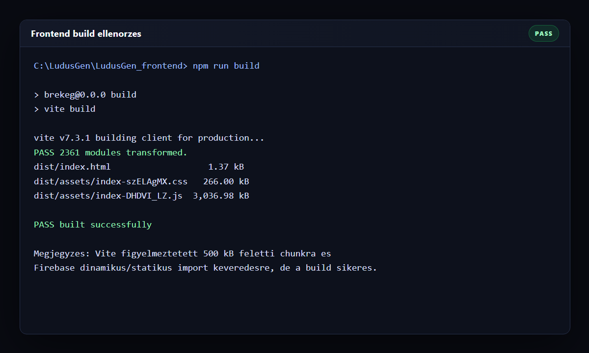

*18. kép: Sikeres frontend build.*

### Frontend tesztek

Futtatott parancs:

```powershell
cd C:\LudusGen\LudusGen_testing
npm run test:run -- frontend
```

Eredmény:

- 2 tesztfájl sikeres;
- 24 frontend teszt sikeres;
- tesztelt fájlok: `frontend/context.test.jsx`, `frontend/login.test.jsx`.

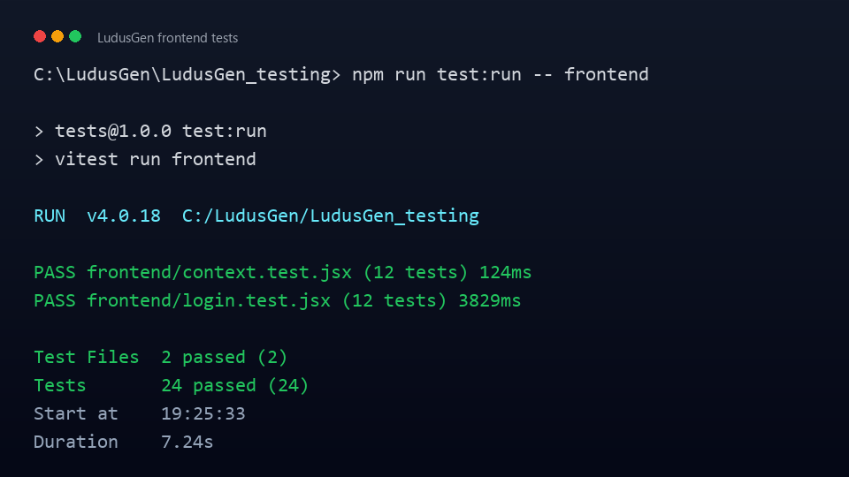

*19. kép: Frontend tesztek sikeres futása.*

A frontend tesztkörnyezetben célzott mockok vannak a külső és böngészőfüggő részekre:

- Firebase Auth mock a bejelentkezési állapotokhoz;
- Firebase app mock a frontend provider teszteléséhez;
- axios mock a backend hívások ellenőrzéséhez;
- framer-motion mock, hogy animáció nélkül stabilan rendereljenek a komponensek;
- React/React DOM alias és dedupe beállítás a `vitest.config.js` fájlban, hogy a komponensek és a tesztkörnyezet ugyanazt a React példányt használják.

### Backend tesztek

Futtatott parancs:

```powershell
cd C:\LudusGen\LudusGen_testing
npm run test:run -- backend
```

Eredmény:

- 2 backend tesztfájl sikeres;
- 54 backend teszt sikeres;
- tesztelt fájlok: `backend/auth.test.js`, `backend/profile.test.js`.

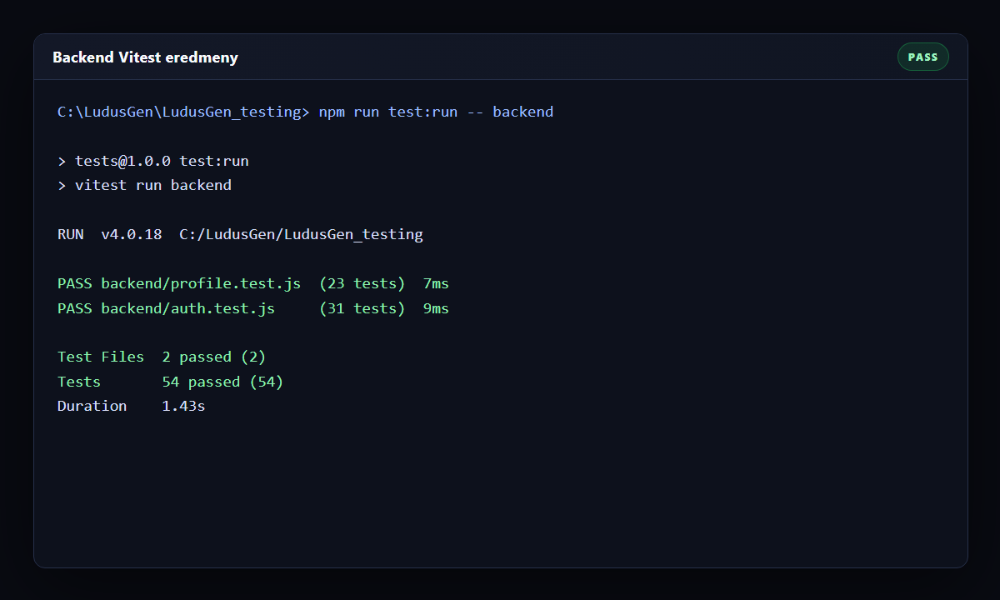

*20. kép: Backend tesztek sikeres futása.*

A backend tesztek a legfontosabb vizsgaszempontból kritikus részeket fedik:

- regisztráció validáció;
- email és jelszó hibakezelés;
- 2FA ellenőrzés;
- Google session validáció;
- profiladatok lekérése;
- profiladatok módosítása;
- profilkép feltöltés és törlés;
- Firestore és külső szolgáltatások mockolt hibakezelése.

### Teljes tesztfuttatás

Futtatott parancs:

```powershell
cd C:\LudusGen\LudusGen_testing
npm run test:run
```

Összesített eredmény:

- 5 tesztfájl sikeres;
- 88 teszt sikeres;
- frontend, backend és integrációs tesztek együtt sikeresen lefutottak.

### Tesztelésből levont következtetés

A tesztek alapján a vizsgaremek legfontosabb elemei működnek:

- a felhasználókezelés és 2FA backend logikája;
- a profilkezelés és profilkép műveletek;
- a frontend auth modal fontosabb felhasználói útjai;
- a frontend globális user context működése;
- a backend hívásokra épülő állapotkezelés;
- a teljes build folyamat.

## Futtatási segédlet

### Backend indítása

```powershell
cd C:\LudusGen\LudusGen_backend
npm run start
```

Alapértelmezett backend fejlesztői cím:

```text
http://localhost:3001
```

### Frontend indítása

```powershell
cd C:\LudusGen\LudusGen_frontend
npm run dev -- --host=127.0.0.1 --port=5173
```

Frontend fejlesztői cím:

```text
http://127.0.0.1:5173
```

### Tesztek futtatása

Frontend tesztek:

```powershell
cd C:\LudusGen\LudusGen_testing
npm run test:run -- frontend
```

Backend tesztek:

```powershell
cd C:\LudusGen\LudusGen_testing
npm run test:run -- backend
```

Teljes tesztcsomag:

```powershell
cd C:\LudusGen\LudusGen_testing
npm run test:run
```

## Képernyőképek listája

| Fájl | Mire szolgál a dokumentációban? |
| --- | --- |
| `docs/screenshots/home-desktop.png` | Desktop Home oldal. |
| `docs/screenshots/home-studio-preview.png` | Új Home AI Studio preview blokk, valós LudusGen modul képekkel. |
| `docs/screenshots/home-credits.png` | Új Home kreditcsomag / pricing blokk. |
| `docs/screenshots/login-modal-desktop.png` | Access Hub / login modal. |
| `docs/screenshots/ai-studio-desktop.png` | AI Studio desktop nézet, Image Studio munkaterülettel. |
| `src/assets/home_preview_ludusgen_chat.png` | AI Chat/Code modul előnézeti képpack. |
| `src/assets/home_preview_ludusgen_image.png` | AI Image modul előnézeti képpack. |
| `src/assets/home_preview_ludusgen_audio.png` | AI Audio modul előnézeti képpack. |
| `src/assets/home_preview_ludusgen_3d.png` | AI 3D modul előnézeti képpack. |
| `docs/screenshots/marketplace-desktop.png` | Marketplace desktop hero, kereső és szűrők. |
| `docs/screenshots/forum-desktop.png` | Community / Forum desktop nézet. |
| `docs/screenshots/home-mobile.png` | Mobil Home oldal. |
| `docs/screenshots/mobile-menu.png` | Mobil hamburger menü. |
| `docs/screenshots/marketplace-mobile.png` | Mobil Marketplace kereső és szűrőpanel. |
| `docs/screenshots/ai-studio-mobile.png` | Mobil AI Studio modulválasztó. |
| `docs/screenshots/forum-mobile.png` | Mobil Community / Forum. |
| `docs/screenshots/profile-mobile.png` | Mobil Profile / Settings, maszkolt email címmel. |
| `docs/screenshots/frontend-build.png` | Sikeres frontend build bizonyítéka. |
| `docs/screenshots/tests-frontend.png` | Sikeres frontend tesztek bizonyítéka. |
| `docs/screenshots/tests-backend.png` | Sikeres backend tesztek bizonyítéka. |

## Összegzés

A LudusGen egy integrált, AI-alapú alkotói platform, ahol a felhasználó ugyanazon felületen tud kódot, képet, hangot és 3D assetet generálni, majd ezeket közösségi vagy marketplace workflow-ban továbbvinni. A projekt értéke nem egyetlen különálló AI funkcióban van, hanem abban, hogy a teljes folyamat egységes felhasználói élményben működik: azonos hitelesítéssel, közös kreditrendszerrel, egységes előzménykezeléssel és központi API réteggel.

Szakmai szempontból a dokumentáció külön kiemeli:

- a kódgenerálás és chat munkafolyamat session/szintű memóriáját és summary kezelését;
- a képgenerálás paraméterezhető pipeline-ját (prompt, seed, arány, upscale, history);
- az audio generálás két fő módját (TTS és zene), modellválasztással és visszahallgatható előzményekkel;
- a 3D generálás task-alapú működését Tripo3D és Trellis providerrel, státuszkövetéssel és letöltési útvonallal;
- a vizuális dokumentálást modul-specifikus képpackekkel és desktop/mobil képernyőképekkel.

A dokumentáció így nemcsak a vizsgakövetelményeket (a-f) teljesíti, hanem részletesen bemutatja azt is, hogy a LudusGen pontosan hogyan működik végponttól végpontig, a prompt beküldéstől a kész tartalom visszakereséséig.
